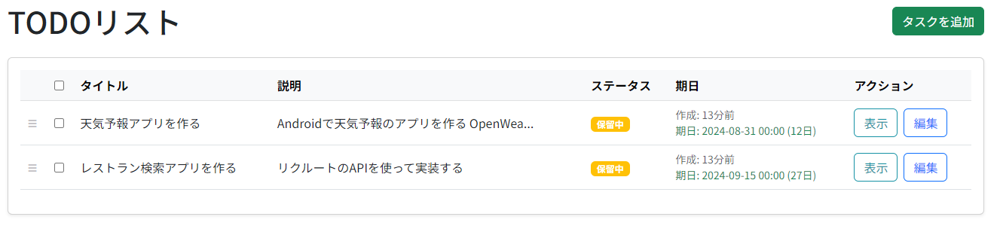

# TODOリストアプリケーション
このアプリケーションは、Ruby on Railsで作られたTODO リストアプリケーションです。<br>
タスクの作成、表示、編集、および管理ができます。<br>
タスクは、タイトル、説明、ステータス、期限などの詳細とともにリスト形式で表示されます。<br>



## 特徴
- タスクの追加、表示、編集、削除が可能
- タスクのステータス管理（例：保留中、完了）
- タスクの期限を表示
- Bootstrap を使用したレスポンシブデザイン

## 前提条件
- Docker と Docker Compose のインストール
- Ruby 3.2.4
- MySQL 8.4
- Rails 7.2.0

## インストール手順
1. リポジトリをクローンします:
   ```bash
   git clone https://github.com/yourusername/todo-list-app.git
   cd todo-list-app
   ```
2. Dockerコンテナをビルドします:
   ```bash
   docker-compose build
   ```
3. アプリケーションを起動します:
   ```bash
   docker-compose up
   ```
4. データベースをセットアップします:
   ```bash
   docker-compose run web rails db:create db:migrate
   ```
5. アプリケーションにアクセスします:<br>
   ブラウザを開き、`http://localhost:3000` にアクセスします。

## 使い方
- **タスクを追加**: 「タスクを追加」ボタンをクリックして、新しいタスクを作成します。タイトル、説明、期限を入力して、タスクを保存します。
- **タスクを表示**: 「表示」をクリックして、タスクの詳細を確認します。
- **タスクを編集**: 「編集」をクリックして、タスクの詳細を変更します。
- **タスクを削除**:  チェックボックスをクリックし、「削除」を表示させ、タスクの削除できます。
- **ステータス管理**: ステータスボタンを使用して、タスクのステータスを変更します。

## 使用技術
- **Ruby on Rails**: アプリケーションを構築するためのフレームワーク。
- **Docker**: アプリケーションを隔離された環境で実行するためのコンテナ化ツール。
- **MySQL**: タスクを保存するためのリレーショナルデータベース。
- **Bootstrap**: フロントエンドのスタイリングフレームワーク。
- **Turbo-Rails & Stimulus-Rails**: SPAのような動作やJavaScriptの処理を担当。
- **acts_as_list**: タスクの順序を管理するためのGem。

## 使用したGem
- `rails`: Railsフレームワーク。
- `mysql2`: Rails用のMySQLデータベースアダプター。
- `puma`: Rails用のウェブサーバー。
- `importmap-rails`: JavaScriptの依存関係を管理。
- `turbo-rails`: SPAのようなページアクセラレーター。
- `stimulus-rails`: 軽量なJavaScriptフレームワーク。
- `rails-i18n`: 国際化対応。
- `acts_as_list`: タスクの順序管理機能を提供。
- `bootsnap`: キャッシュによりブート時間を短縮。

## 国際化（I18n）
このアプリケーションは英語と日本語に対応しており、デフォルトは日本語に設定しています。

## 将来の改善点
- 言語選択の追加
- タスクのカテゴリまたはタグの追加

## ライセンス
このプロジェクトは MIT ライセンスの下でライセンスされています。詳細は `LICENSE` ファイルをご覧ください。
